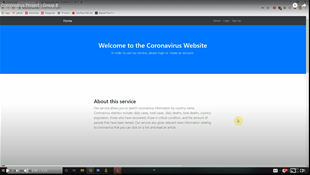

# cen4010-s2020-g08
## CEN 4010 Group 08 Project
### Corona Virus News
## Powered by GNews, disease[dot]sh API, and phpMyAdmin

Group Members:

Muhammad Asmar\
Jordan Barrios\
Kyle Costela\
Parker Hawkins

### Demonstration Video
*Click the thumbnail*

### Built with
* HTML, CSS, JavaScript, BootStrap, PHP
* [GNews API](https://gnews.io/docs/v3?javascript#introduction "GNews API")
* [disease[dot]sh API ](https://corona.lmao.ninja/v2/countries/usa "COVID data API")
* phpMyAdmin

### Features
* Most recent news articles feed
* Article Preview
* Statistics
* Comment Section
* Account Creation/Login

### Final Report
[Click here](https://docs.google.com/document/d/12seRvECOQXYCFhAxVLoT2DoCo_G9T6udMS_k6x_A_30/edit?usp=sharing "Final Report") to view the final milestone report for this project